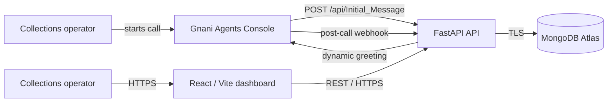

# EMI Flow — EMI Payment Collection

A recruiter-demo quality, end-to-end EMI collection application. The FastAPI service validates initial call requests, receives idempotent post-call webhooks, and stores results in MongoDB Atlas. The React dashboard displays the persisted call data and includes an explicitly labeled mock-call action for the FDE demonstration.

> Demo data only. Never place real customer data or secrets in this repository.

## Live deployment

The application is deployed on Render and can be reviewed without running it locally:

- **Dashboard:** <https://emi-flow-dashboard.onrender.com>
- **FastAPI service:** <https://emi-flow-api.onrender.com>
- **Interactive API documentation:** <https://emi-flow-api.onrender.com/docs>
- **Readiness check:** <https://emi-flow-api.onrender.com/health/ready>

The Render free-tier services may spin down during inactivity. Before a live demonstration, I deploy the latest commit to restore a fresh live state and then refresh the dashboard. The first backend request can still take approximately 50 seconds while the service starts.

## Submission report

The evidence-backed FDE report is available as [submission/EMI_Flow_FDE_Submission.pdf](submission/EMI_Flow_FDE_Submission.pdf). It covers the architecture, mandatory scenarios, demonstration expectations, acceptance criteria, bonus requirements, Gnani credit/trigger limitations, production-readiness plan, and embedded screenshots. The editable source is [submission/EMI_Flow_FDE_Submission.docx](submission/EMI_Flow_FDE_Submission.docx).

## Architecture



Live voice tests are started manually inside the Gnani Agents Console. Because the current Gnani account does not expose provider-issued outbound-trigger credentials, the dashboard also offers a clearly labeled FDE mock workflow: it submits complete customer data to `Initial_Message`, stores a mocked provider ID, and waits for a simulated post-call webhook. No phone call is placed by the mock action. See [docs/architecture.md](docs/architecture.md) for the full sequence.

The FDE assignment's intended initiation flow differs from the dynamic-greeting
callback observed in the console. See
[docs/gnani-integration-findings.md](docs/gnani-integration-findings.md) for the
captured payload, contract comparison, post-call-only tradeoffs, and recommended
final architecture.

## Optional local development

The live Render deployment above is the primary demonstration environment. Use the following only when running or modifying the project locally.

Requirements: Docker 24+ and a MongoDB Atlas connection string. Atlas is the intended datastore; the Compose file deliberately does **not** start a local MongoDB.

1. Copy `.env.example` to `.env`.
2. Set `MONGODB_URI` to an Atlas URI and choose a strong `WEBHOOK_API_KEY`.
3. Run `docker compose up --build`.
4. Open `http://localhost:8080`. API docs are at `http://localhost:8000/docs`.

For backend development:

```bash
cd backend
python -m venv .venv && source .venv/bin/activate
pip install -r requirements-dev.txt
uvicorn app.main:app --reload
```

For frontend development:

```bash
cd frontend
npm ci
npm run dev
```

The dashboard uses `VITE_API_URL=http://localhost:8000` by default. `VITE_API_URL` is compiled into the frontend image; set it to the public API URL during a hosted build.

For the FDE demo, the dashboard's **Create test call** action submits the complete
customer/EMI form to `POST /api/Initial_Message`. With
`GNANI_MOCK_MODE=true`, FastAPI validates and stores the call, returns a
`mock-...` provider ID and generated greeting, but does not place a phone call.
A post-call webhook can then complete the same record.

## API examples

Set the deployed API base URL:

```bash
API_BASE_URL=https://emi-flow-api.onrender.com
```

Store a mock call and receive the generated greeting:

```bash
curl -X POST "$API_BASE_URL/api/Initial_Message" \
  -H 'Content-Type: application/json' \
  -d '{"customer_id":"CUS-1042","customer_name":"Maya Rivera","phone":"+14155550184","language":"en","emi_amount":18450,"currency":"INR","due_date":"2026-08-05","loan_account":"LN-84021"}'
```

The response includes `initial_message` — the greeting text the Gnani agent should speak first.

Deliver a post-call event:

```bash
curl -X POST "$API_BASE_URL/api/v1/webhooks/post-call" \
  -H 'Content-Type: application/json' \
  -H 'X-Webhook-API-Key: change-me' \
  -H 'X-Webhook-Id: evt_demo_001' \
  -d '{"call_id":"<CALL_ID_FROM_PREVIOUS_RESPONSE>","DISPOSITION":"PROMISE_TO_PAY","transcript":[{"speaker":"agent","text":"Hello Maya, I am calling about your upcoming EMI.","timestamp_ms":0},{"speaker":"customer","text":"I will pay on Friday.","timestamp_ms":3500}],"analytics":{"summary":"Customer committed to pay Friday.","sentiment":"positive","duration_seconds":52}}'
```

The Postman collection in `postman/CollectFlow.postman_collection.json` contains the same flow.

## Gnani integration

Calls are triggered manually inside the **Gnani Agents Console**, not by this application. The flow is:

1. An operator opens the Gnani Agents Console and starts a call, entering the customer/EMI fields (customer name, customer ID, loan account, EMI amount, due date, preferred language) and a whitelisted phone number.
2. The console calls this API's `POST /api/Initial_Message`. The endpoint accepts either the full EMI fields shown in the API example or Gnani's session-only payload (`call_id`, `flow_id`, `user_id`, etc.), stores the call record (`status: "triggered"`) in MongoDB, and returns an `initial_message`. The Gnani `call_id` is retained so the post-call webhook updates the same record. When EMI fields are absent, the record and greeting use safe placeholders rather than rejecting the call.
3. The console places the outbound call and conducts the conversation. My captured console evidence shows Gnani Evon v2.0 Fast and Gnani Timbre G v1.0 with the Jenny voice. Timbre G v1.0 was the only TTS model available in my Agent Console account; Timbre 2.5 was not offered.
4. When the call ends, the console (or its backend) posts the outcome to `POST /api/v1/webhooks/post-call`, which stores the disposition, transcript, and analytics, and is idempotent against duplicate deliveries.

If an authenticated post-call event arrives for a call that has no initial record (for example, an older deployment rejected the initial payload), the backend creates a recovery record and applies the result. This preserves the call in MongoDB and the dashboard, but fields Gnani never sent remain `unknown`/`0`; real customer and EMI values must be included by Gnani or resolved from another data source using `user_id`.

**For this to work when deployed, the console needs a publicly reachable URL for step 2** — e.g. your Render backend's `https://<your-backend>.onrender.com/api/Initial_Message` — configured in the console as the agent's "Initial Message" endpoint. Ask your Gnani contact for the exact field name and request/response contract they expect, since this is registered per-agent in the console rather than via an env var here.

Webhooks must send `X-Webhook-API-Key`; `X-Webhook-Id` is preferred, otherwise a SHA-256 fingerprint deduplicates the delivery. Disposition mapping is configured by `GNANI_DISPOSITION_MAP_JSON`.

## Data model

Collection: `calls`

| Field | Purpose |
| --- | --- |
| `_id` | MongoDB ObjectId |
| `call_id` | Public UUID, unique |
| `customer` / `emi` | Validated request snapshot |
| `status` | `triggered` or `completed` |
| `stage_code` | Normalized application stage |
| `provider_call_id` | Gnani call identifier (set by the post-call webhook, if provided) |
| `webhook_ids` | Delivery IDs already applied |
| `transcript` / `outcome` | Post-call result |
| `raw_payload` | Original sanitized webhook body |
| `created_at` / `updated_at` | UTC timestamps |

Indexes are created at startup for unique `call_id`, sparse unique `provider_call_id`, `created_at`, `stage_code`, `status`, and `customer.customer_id`.

## Render deployment

The current hosted environment uses:

- Render Web Service for `backend/Dockerfile`
- Render Static Site for the React/Vite dashboard
- MongoDB Atlas for the `emi_flow.calls` collection
- `VITE_API_URL=https://emi-flow-api.onrender.com` in the dashboard build
- `CORS_ORIGINS=https://emi-flow-dashboard.onrender.com` in the backend environment
- `GNANI_MOCK_MODE=true` for the documented FDE mock-trigger workflow

Gnani endpoints:

- Initial message: `https://emi-flow-api.onrender.com/api/Initial_Message`
- Post-call webhook: `https://emi-flow-api.onrender.com/api/v1/webhooks/post-call`

For production, keep credentials in the hosting platform’s secret manager, rotate the webhook key, restrict Atlas IP access, enable backups/alerts, and add an authenticated operator login before real customer use.

## Tests and verification

```bash
cd backend && pytest
cd frontend && npm ci && npm run test && npm run build
docker compose config
```

Backend tests use an in-memory fake repository and never contact Atlas or Gnani.
