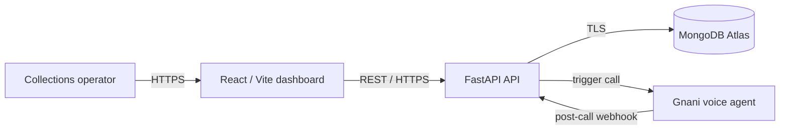

# CollectFlow — EMI Payment Collection

A recruiter-demo quality, end-to-end EMI collection application. The React dashboard gives operations teams a clear view of automated collection calls; the FastAPI service accepts call requests, safely triggers Gnani (or mock mode), receives idempotent post-call webhooks, and stores results in MongoDB Atlas.

> Demo data only. Never place real customer data or secrets in this repository.

## Architecture



## Quick start

Requirements: Docker 24+ and a MongoDB Atlas connection string. Atlas is the intended datastore; the Compose file deliberately does **not** start a local MongoDB.

1. Copy `.env.example` to `.env`.
2. Set `MONGODB_URI` to an Atlas URI and choose a strong `WEBHOOK_API_KEY`.
3. Run `docker compose up --build`.
4. Open `http://localhost:8080`. API docs are at `http://localhost:8000/docs`.

For backend development:

```bash
cd backend
python -m venv .venv && source .venv/bin/activate
pip install -r requirements-dev.txt
uvicorn app.main:app --reload
```

For frontend development:

```bash
cd frontend
npm ci
npm run dev
```

The dashboard uses `VITE_API_URL=http://localhost:8000` by default. `VITE_API_URL` is compiled into the frontend image; set it to the public API URL during a hosted build.

## API examples

Create a pending call (mock mode by default):

```bash
curl -X POST http://localhost:8000/api/Initial_Message \
  -H 'Content-Type: application/json' \
  -d '{"customer_id":"CUS-1042","customer_name":"Maya Rivera","phone":"+14155550184","language":"en","emi_amount":18450,"currency":"INR","due_date":"2026-08-05","loan_account":"LN-84021"}'
```

Deliver a post-call event:

```bash
curl -X POST http://localhost:8000/api/v1/webhooks/post-call \
  -H 'Content-Type: application/json' \
  -H 'X-Webhook-API-Key: change-me' \
  -H 'X-Webhook-Id: evt_demo_001' \
  -d '{"call_id":"<CALL_ID_FROM_PREVIOUS_RESPONSE>","DISPOSITION":"PROMISE_TO_PAY","transcript":[{"speaker":"agent","text":"Hello Maya, I am calling about your upcoming EMI.","timestamp_ms":0},{"speaker":"customer","text":"I will pay on Friday.","timestamp_ms":3500}],"analytics":{"summary":"Customer committed to pay Friday.","sentiment":"positive","duration_seconds":52}}'
```

The Postman collection in `postman/CollectFlow.postman_collection.json` contains the same flow.

## Gnani integration

`GNANI_MOCK_MODE=true` prevents outbound calls and returns a deterministic mock provider ID. For a live integration, set:

- `GNANI_MOCK_MODE=false`
- `GNANI_TRIGGER_URL` to the trigger endpoint
- `GNANI_API_KEY` to the provider credential
- `GNANI_AGENT_ID` to the existing English/Spanish agent

The trigger sends stable `pre_call_variables`, uses a bounded timeout, and retries transient failures with exponential backoff. Adapt only `app/gnani.py` if the provider contract differs. Webhooks must send `X-Webhook-API-Key`; `X-Webhook-Id` is preferred, otherwise a SHA-256 fingerprint deduplicates the delivery. Disposition mapping is configured by `GNANI_DISPOSITION_MAP_JSON`.

## Data model

Collection: `calls`

| Field | Purpose |
| --- | --- |
| `_id` | MongoDB ObjectId |
| `call_id` | Public UUID, unique |
| `customer` / `emi` | Validated request snapshot |
| `status` | `pending`, `triggered`, `completed`, or `trigger_failed` |
| `stage_code` | Normalized application stage |
| `provider_call_id` | Gnani call identifier |
| `webhook_ids` | Delivery IDs already applied |
| `transcript` / `outcome` | Post-call result |
| `raw_payload` | Original sanitized webhook body |
| `created_at` / `updated_at` | UTC timestamps |

Indexes are created at startup for unique `call_id`, sparse unique `provider_call_id`, `created_at`, `stage_code`, `status`, and `customer.customer_id`.

## Public deployment

This repository does not create accounts or deploy anything. A straightforward hosted path:

1. Create an Atlas M10+ cluster (or free tier for a demo), database user, and network rule limited to the backend host’s egress IP. Require TLS and do not expose the URI to the browser.
2. Deploy `backend/Dockerfile` to Render, Railway, Fly.io, Cloud Run, or another container host. Set the backend environment variables from `.env.example`, `CORS_ORIGINS` to the public dashboard origin, and expose container port `8000`. Verify `/health/ready`.
3. Set Gnani’s post-call URL to `https://api.example.com/api/v1/webhooks/post-call` and configure the same webhook API key on both sides.
4. Build `frontend/Dockerfile` with `--build-arg VITE_API_URL=https://api.example.com`, deploy the image on any public container platform, and expose port `8080`.
5. Put both services behind HTTPS, add custom DNS, then confirm from a different network that the dashboard, `/health/ready`, call creation, and webhook flow work.

For production, keep credentials in the hosting platform’s secret manager, rotate the webhook key, restrict Atlas IP access, enable backups/alerts, and add an authenticated operator login before real customer use.

## Tests and verification

```bash
cd backend && pytest
cd frontend && npm ci && npm run test && npm run build
docker compose config
```

Backend tests use an in-memory fake repository and never contact Atlas or Gnani.

