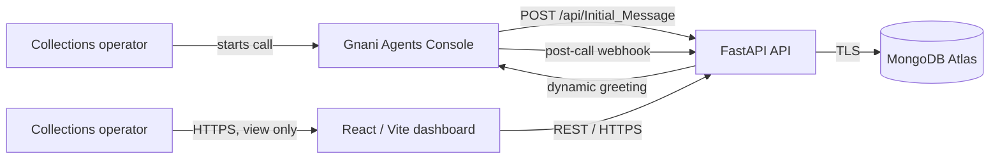

# EMI Flow — EMI Payment Collection

A recruiter-demo quality, end-to-end EMI collection application. Calls are placed from the Gnani Agents Console; the FastAPI service supplies the dynamic initial greeting, receives idempotent post-call webhooks, and stores results in MongoDB Atlas. The React dashboard is a read-only view of that data — it never triggers or controls calls.

> Demo data only. Never place real customer data or secrets in this repository.

## Architecture



Calls are triggered manually inside the Gnani Agents Console (not from this app). The console calls this API's `Initial_Message` endpoint to fetch the dynamic greeting and register the call, then places the outbound call itself. See [docs/architecture.md](docs/architecture.md) for the full sequence.

## Quick start

Requirements: Docker 24+ and a MongoDB Atlas connection string. Atlas is the intended datastore; the Compose file deliberately does **not** start a local MongoDB.

1. Copy `.env.example` to `.env`.
2. Set `MONGODB_URI` to an Atlas URI and choose a strong `WEBHOOK_API_KEY`.
3. Run `docker compose up --build`.
4. Open `http://localhost:8080`. API docs are at `http://localhost:8000/docs`.

For backend development:

```bash
cd backend
python -m venv .venv && source .venv/bin/activate
pip install -r requirements-dev.txt
uvicorn app.main:app --reload
```

For frontend development:

```bash
cd frontend
npm ci
npm run dev
```

The dashboard uses `VITE_API_URL=http://localhost:8000` by default. `VITE_API_URL` is compiled into the frontend image; set it to the public API URL during a hosted build.

## API examples

Store a call and get back the dynamic greeting (in production this is called by the Gnani Agents Console, not this app, after an operator manually starts a call there):

```bash
curl -X POST http://localhost:8000/api/Initial_Message \
  -H 'Content-Type: application/json' \
  -d '{"customer_id":"CUS-1042","customer_name":"Maya Rivera","phone":"+14155550184","language":"en","emi_amount":18450,"currency":"INR","due_date":"2026-08-05","loan_account":"LN-84021"}'
```

The response includes `initial_message` — the greeting text the Gnani agent should speak first.

Deliver a post-call event:

```bash
curl -X POST http://localhost:8000/api/v1/webhooks/post-call \
  -H 'Content-Type: application/json' \
  -H 'X-Webhook-API-Key: change-me' \
  -H 'X-Webhook-Id: evt_demo_001' \
  -d '{"call_id":"<CALL_ID_FROM_PREVIOUS_RESPONSE>","DISPOSITION":"PROMISE_TO_PAY","transcript":[{"speaker":"agent","text":"Hello Maya, I am calling about your upcoming EMI.","timestamp_ms":0},{"speaker":"customer","text":"I will pay on Friday.","timestamp_ms":3500}],"analytics":{"summary":"Customer committed to pay Friday.","sentiment":"positive","duration_seconds":52}}'
```

The Postman collection in `postman/CollectFlow.postman_collection.json` contains the same flow.

## Gnani integration

Calls are triggered manually inside the **Gnani Agents Console**, not by this application. The flow is:

1. An operator opens the Gnani Agents Console and starts a call, entering the customer/EMI fields (customer name, customer ID, loan account, EMI amount, due date, preferred language) and a whitelisted phone number.
2. The console calls this API's `POST /api/Initial_Message`. The endpoint accepts either the full EMI fields shown in the API example or Gnani's session-only payload (`call_id`, `flow_id`, `user_id`, etc.), stores the call record (`status: "triggered"`) in MongoDB, and returns an `initial_message`. The Gnani `call_id` is retained so the post-call webhook updates the same record. When EMI fields are absent, the record and greeting use safe placeholders rather than rejecting the call.
3. The console places the outbound call and conducts the conversation using Prisma ASR, Timbre 2.5 TTS, and Evon LLM.
4. When the call ends, the console (or its backend) posts the outcome to `POST /api/v1/webhooks/post-call`, which stores the disposition, transcript, and analytics, and is idempotent against duplicate deliveries.

If an authenticated post-call event arrives for a call that has no initial record (for example, an older deployment rejected the initial payload), the backend creates a recovery record and applies the result. This preserves the call in MongoDB and the dashboard, but fields Gnani never sent remain `unknown`/`0`; real customer and EMI values must be included by Gnani or resolved from another data source using `user_id`.

**For this to work when deployed, the console needs a publicly reachable URL for step 2** — e.g. your Render backend's `https://<your-backend>.onrender.com/api/Initial_Message` — configured in the console as the agent's "Initial Message" endpoint. Ask your Gnani contact for the exact field name and request/response contract they expect, since this is registered per-agent in the console rather than via an env var here.

Webhooks must send `X-Webhook-API-Key`; `X-Webhook-Id` is preferred, otherwise a SHA-256 fingerprint deduplicates the delivery. Disposition mapping is configured by `GNANI_DISPOSITION_MAP_JSON`.

## Data model

Collection: `calls`

| Field | Purpose |
| --- | --- |
| `_id` | MongoDB ObjectId |
| `call_id` | Public UUID, unique |
| `customer` / `emi` | Validated request snapshot |
| `status` | `triggered` or `completed` |
| `stage_code` | Normalized application stage |
| `provider_call_id` | Gnani call identifier (set by the post-call webhook, if provided) |
| `webhook_ids` | Delivery IDs already applied |
| `transcript` / `outcome` | Post-call result |
| `raw_payload` | Original sanitized webhook body |
| `created_at` / `updated_at` | UTC timestamps |

Indexes are created at startup for unique `call_id`, sparse unique `provider_call_id`, `created_at`, `stage_code`, `status`, and `customer.customer_id`.

## Public deployment

This repository does not create accounts or deploy anything. A straightforward hosted path:

1. Create an Atlas M10+ cluster (or free tier for a demo), database user, and network rule limited to the backend host’s egress IP. Require TLS and do not expose the URI to the browser.
2. Deploy `backend/Dockerfile` to Render, Railway, Fly.io, Cloud Run, or another container host. Set the backend environment variables from `.env.example`, `CORS_ORIGINS` to the public dashboard origin, and expose container port `8000`. Verify `/health/ready`.
3. In the Gnani Agents Console, set the agent's Initial Message endpoint to `https://api.example.com/api/Initial_Message` and its post-call webhook to `https://api.example.com/api/v1/webhooks/post-call`, configuring the same webhook API key on both sides.
4. Build `frontend/Dockerfile` with `--build-arg VITE_API_URL=https://api.example.com`, deploy the image on any public container platform, and expose port `8080`.
5. Put both services behind HTTPS, add custom DNS, then confirm from a different network that the dashboard, `/health/ready`, and a console-triggered call all reach this API and appear on the dashboard.

For production, keep credentials in the hosting platform’s secret manager, rotate the webhook key, restrict Atlas IP access, enable backups/alerts, and add an authenticated operator login before real customer use.

## Tests and verification

```bash
cd backend && pytest
cd frontend && npm ci && npm run test && npm run build
docker compose config
```

Backend tests use an in-memory fake repository and never contact Atlas or Gnani.
