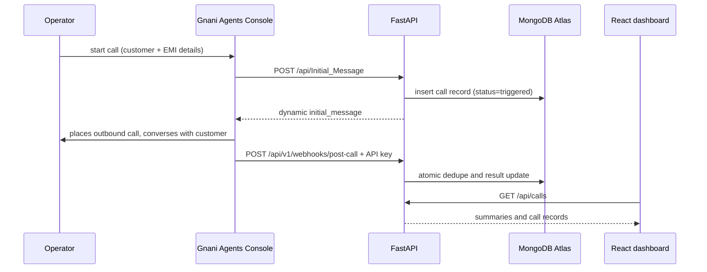

# Architecture and request flow

The call itself is triggered manually inside the Gnani Agents Console, not by this API. The console calls `POST /api/Initial_Message` to fetch the dynamically generated greeting and to let the backend record the call as `triggered`; the API's endpoint must be publicly reachable for the console to call it. The API is the only component allowed to reach Atlas or hold the post-call webhook key. Webhook delivery IDs are added with an atomic conditional update, making retries safe. The dashboard is read-only — it never initiates or controls calls.

