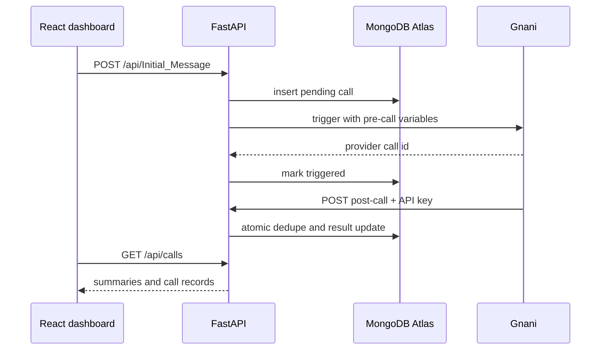

# Architecture and request flow

The API is the only component allowed to reach Atlas or hold Gnani credentials. A call record is persisted before the external trigger, so provider outages remain observable. Webhook delivery IDs are added with an atomic conditional update, making retries safe.

